# Projet : Application E-commerce en Architecture Microservices

Ce projet est une application de e-commerce complète, composée d'un backend en architecture microservices et d'une interface utilisateur frontend développée avec Angular. Il a été réalisé dans le cadre du cours de JEE et Systèmes Avancés.

## Table des Matières
1. [Architecture Globale](#1-architecture-globale)
2. [Stack Technologique](#2-stack-technologique)
3. [Guide de Lancement](#3-guide-de-lancement)
4. [Validation des Composants de l'Architecture](#4-validation-des-composants-de-larchitecture)
5. [Démonstration des Endpoints et Fonctionnalités](#5-démonstration-des-endpoints-et-fonctionnalités)
6. [Interface Frontend (Angular)](#6-interface-frontend-angular)
7. [Auteur](#7-auteur)

---

## 1. Architecture Globale

L'application est décomposée en services indépendants qui collaborent :
*   **`config-server`**: Centralise la configuration de tous les services via un [référentiel Git dédié](https://github.com/elyamanihajar/config-ecom-app).
*   **`discovery-service`**: Annuaire de services (Eureka) qui permet aux services de se trouver dynamiquement.
*   **`gateway-service`**: Point d'entrée unique (API Gateway) qui route les requêtes externes vers les services internes.
*   **`customer-service`**, **`inventory-service`**, **`billing-service`**: Les services métiers qui gèrent respectivement les clients, les produits et la facturation.

---

## 2. Stack Technologique

*   **Langage** : Java 21
*   **Frameworks** : Spring Boot, Spring Cloud (Config, Eureka, Gateway), Spring Data JPA/REST
*   **Communication** : OpenFeign pour les appels inter-services
*   **Gestion de dépendances** : Maven
*   **Base de données** : H2 (en mémoire)

---

## 3. Guide de Lancement

Pour lancer l'application, il est **crucial** de démarrer les services dans l'ordre suivant :
1.  `discovery-service` (port 8761)
2.  `config-server` (port 9999)
3.  `inventory-service`, `customer-service`
4.  `gateway-service` (port 8888)
5.  `billing-service`

---

## 4. Validation des Composants de l'Architecture

Cette section prouve que les piliers de l'architecture sont fonctionnels.

### a. Configuration Centralisée (Config Server)

Le `config-server` (port 9999) expose bien la configuration pour chaque service. Ici, la configuration pour `customer-service` est récupérée depuis le dépôt Git.

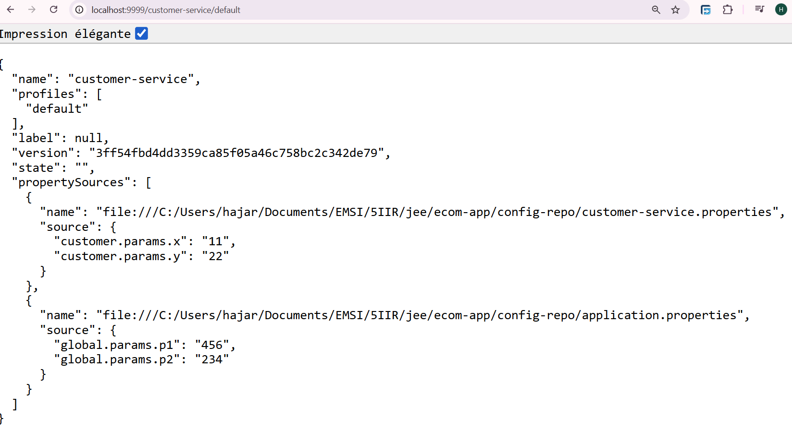

Le `customer-service` charge ensuite cette configuration au démarrage, ce qui est vérifié via des endpoints de test qui affichent les valeurs chargées (paramètres globaux et spécifiques).

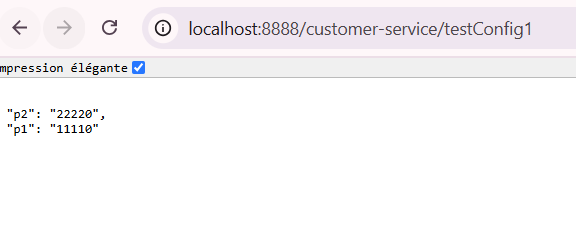
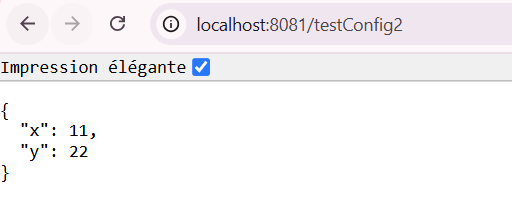

### b. Découverte de Services (Eureka)

Le tableau de bord Eureka (port 8761) montre que tous les services critiques (`CUSTOMER-SERVICE`, `GATEWAY-SERVICE`, `INVENTORY-SERVICE`) sont correctement enregistrés et opérationnels (`UP`).

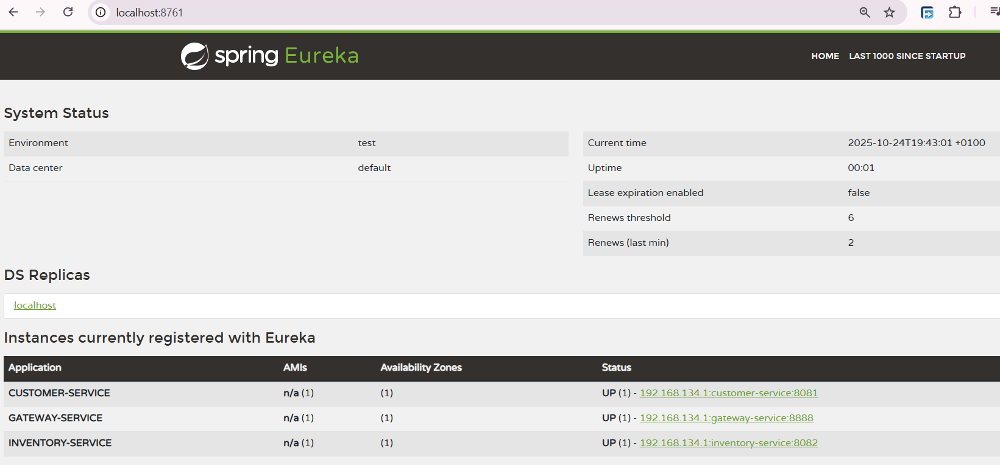

---

## 5. Démonstration des Endpoints et Fonctionnalités

### a. Exposition des Données par les Services Individuels

Chaque microservice expose correctement ses propres endpoints REST, validant leur fonctionnement unitaire.

**Accès direct aux clients :** `http://localhost:8081/customers`
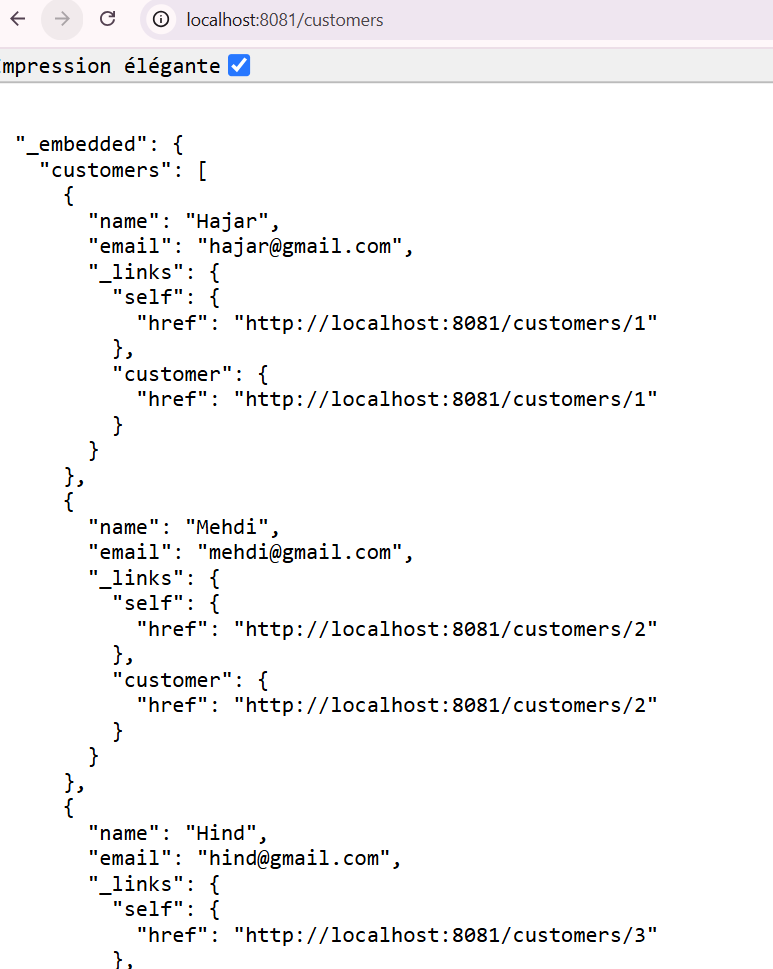

**Accès direct aux produits :** `http://localhost:8082/api/products`
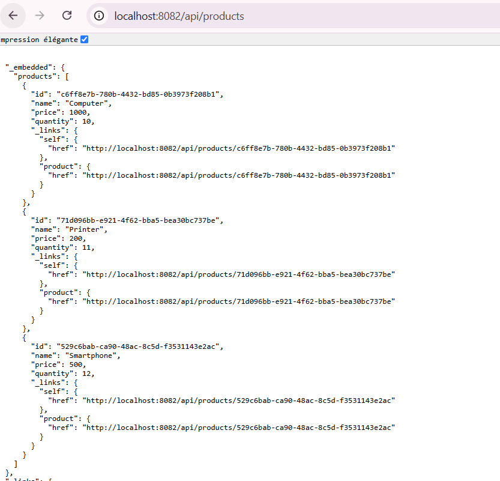

### b. Accès Unifié via la Passerelle (API Gateway)

Toutes les requêtes externes doivent passer par l'API Gateway (port `8888`), qui route le trafic vers les services internes appropriés.

**Liste des clients via la passerelle :** `http://localhost:8888/CUSTOMER-SERVICE/api/customers`
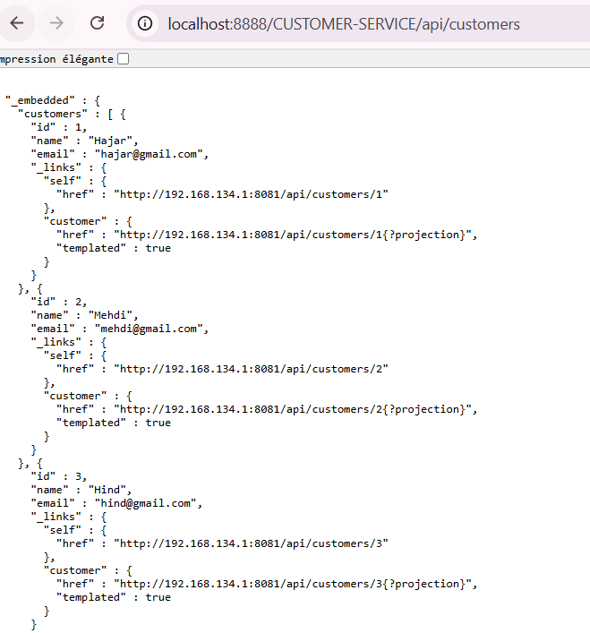

**Liste des produits via la passerelle :** `http://localhost:8888/INVENTORY-SERVICE/api/products`
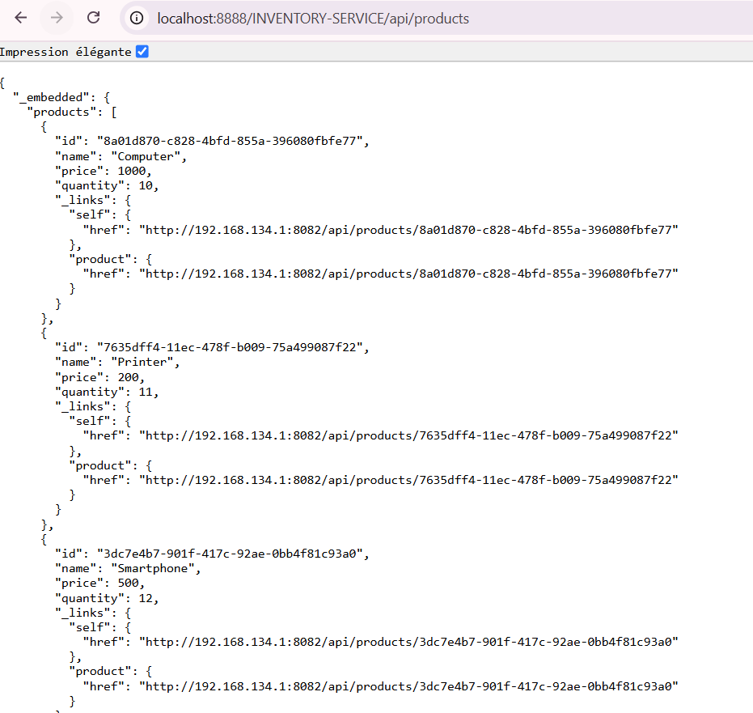

### c. Persistance des Données (Base de Données H2)

Les données sont bien persistées dans la base de données en mémoire de chaque service. La console H2 du `billing-service` montre les `PRODUCT_ITEM` (lignes de facture) enregistrés.

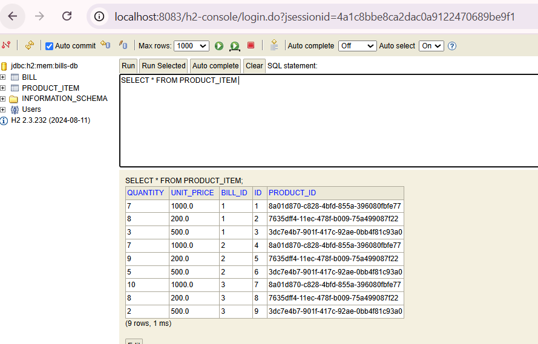

### d. Fonctionnalité Avancée : Projections Spring Data REST

Spring Data REST permet de créer des "vues" personnalisées des entités. Ici, une projection `email` permet de ne récupérer que l'email d'un client, optimisant ainsi la réponse.

**Projection sur un client :** `http://localhost:8081/customers/1?projection=email`
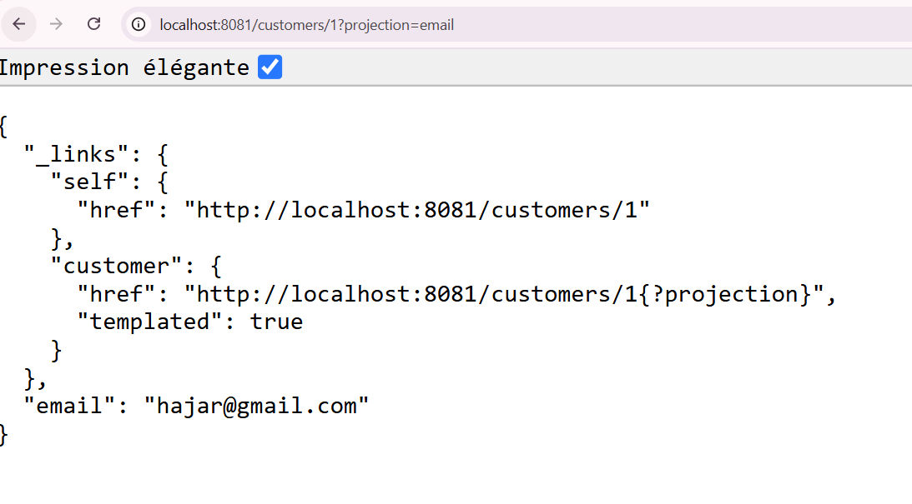

### e. Point Culminant : La Facture Complète (Communication Inter-services)

Le point culminant du projet est la capacité du `billing-service` à agréger les informations des autres services pour construire une facture complète.

D'abord, le service expose la liste des factures avec les IDs des entités liées.
**Liste des factures :** `http://localhost:8888/billing-service/api/bills`
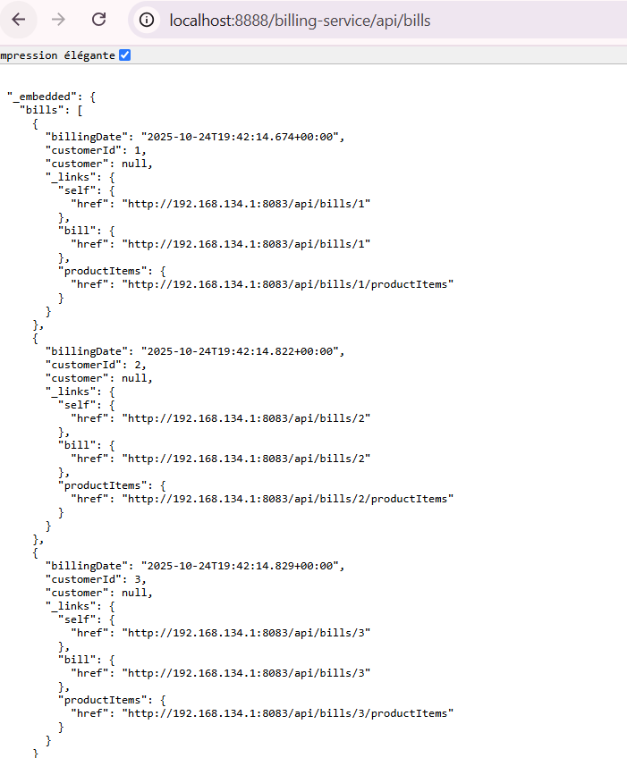

Ensuite, en appelant un endpoint spécifique, une orchestration complexe se produit :
**Requête :** `http://localhost:8888/billing-service/bills/1`

Pour répondre à cette seule requête, le `billing-service` :
1.  Récupère les informations de la facture depuis sa propre base de données.
2.  Utilise **OpenFeign** pour appeler le `customer-service` et obtenir les détails complets du client (`Hajar`).
3.  Appelle le `inventory-service` pour chaque article de la facture afin d'obtenir les détails de chaque produit (`Computer`, `Printer`, etc.).

Le résultat est un objet JSON unique et cohérent qui démontre la parfaite collaboration entre les microservices.

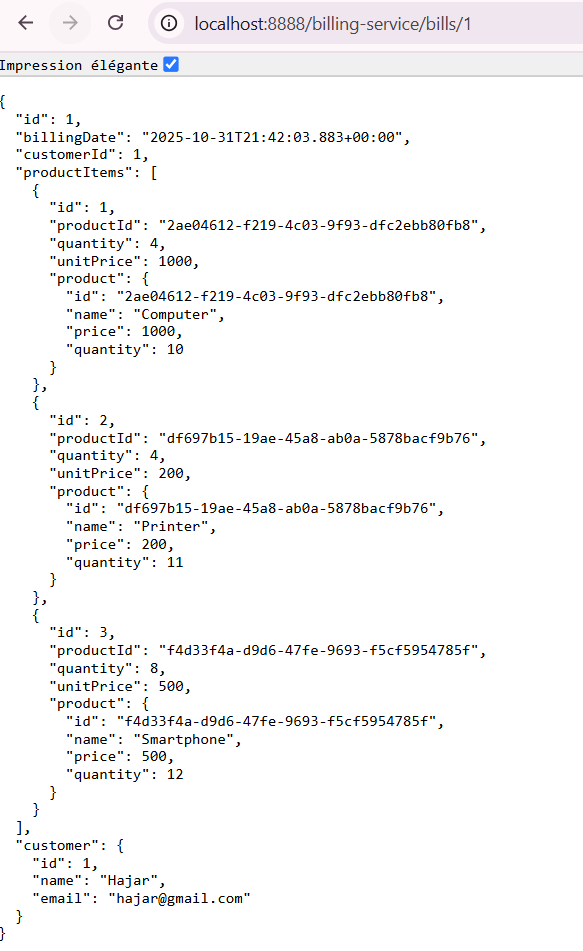

---

## 6. Interface Frontend (Angular)

Le frontend est une application monopage qui offre une interface utilisateur pour interagir avec les données du backend.

### a. Liste des Clients
L'application affiche la liste de tous les clients récupérés depuis le customer-service.
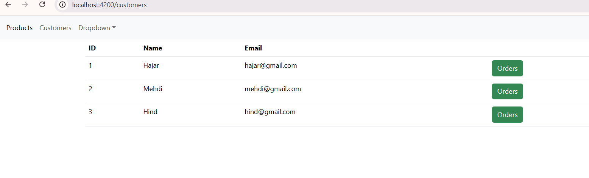

### b. Commandes par Client
En cliquant sur "Orders", l'utilisateur peut voir toutes les commandes passées par un client spécifique.
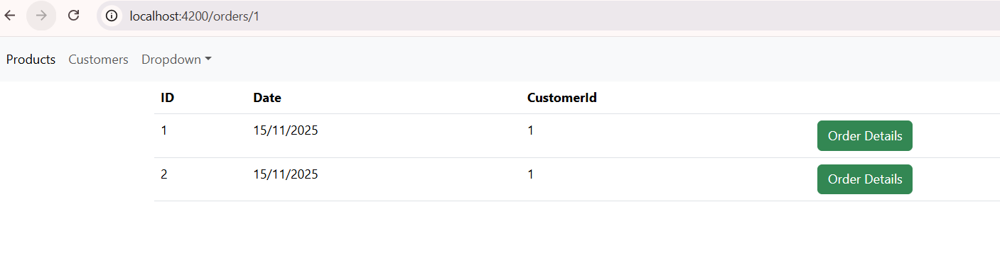

### c. Détails d'une Commande
La vue détaillée d'une commande affiche les informations du client et la liste des produits commandés, avec les quantités et les prix, en agrégeant les données de plusieurs microservices.
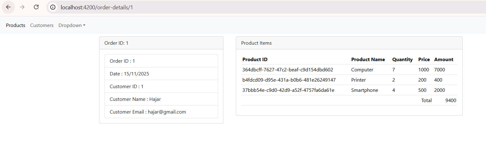

---

## 7. Auteur

*   **Nom** : Hajar ELYAMANI
*   **Classe** : 5IIR
*   **Année Universitaire** : 2025-2026
